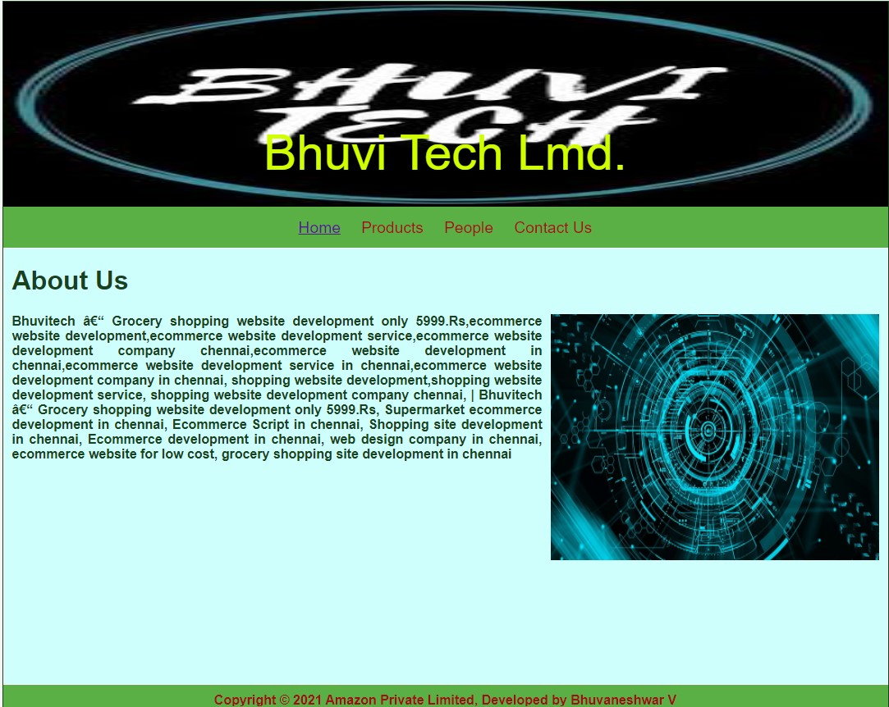
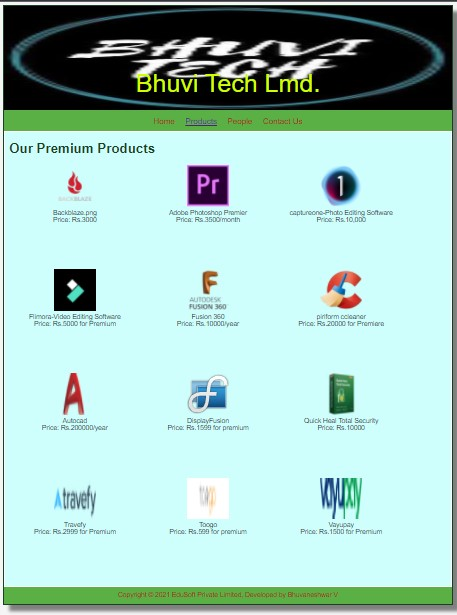
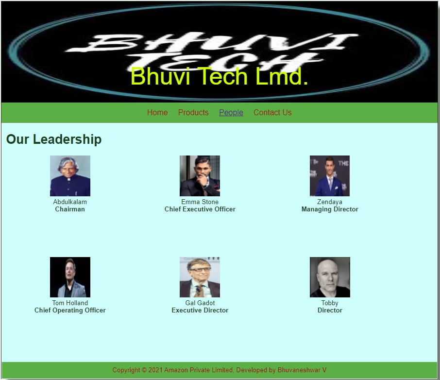
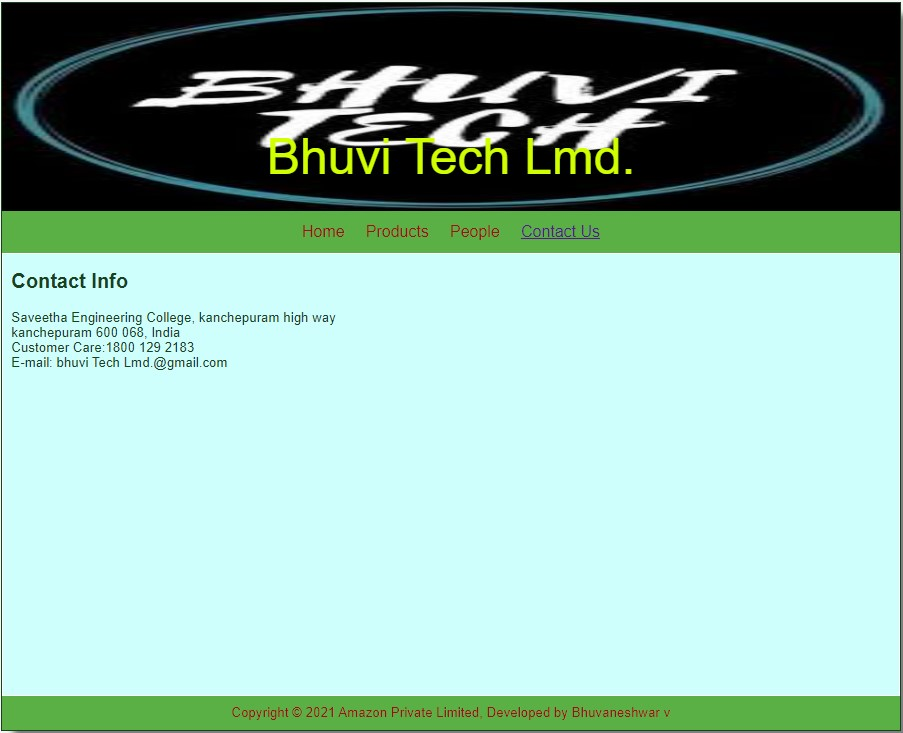

# Web Design for a Software Product Company

## AIM:

To design a static website for a software product company company.

## DESIGN STEPS:

### Step 1:

Requirement collection.

### Step 2:

Creating the layout using HTML and CSS.

### Step 3:

Updating the sample content.

### Step 4:

Choose the appropriate style and color scheme.

### Step 5:

Validate the layout in various browsers.

### Step 6:

Validate the HTML code.

### Step 6:

Publish the website in the given URL.

## PROGRAM :

## OUTPUT:

### Home Page:
```
<!DOCTYPE html>
<html lang="en">
  <head>
    <title>Amazon Private Limited</title>
    <link rel="stylesheet" href="./css/layout.css" />
    <link rel="icon" href="./img/bbb.jpg" type="image/x-icon" />
  </head>

  <body>
    <div class="container">
      <div class="banner">Bhuvi Tech Lmd.</div>
      <div class="menu">
        <div class="menuitemselected"><a href="/static/home.html">Home</a></div>
        <div class="menuitem"><a href="/static/products.html">Products</a></div>
        <div class="menuitem"><a href="/static/people.html">People</a></div>
        <div class="menuitem"><a href="/static/contactus.html">Contact Us</a></div>
      </div>
      <div class="content">
        <div class="homecontent">
          <h1>About Us</h1>
          
          <div class="contenttext">
            <b>Bhuvitech – Grocery shopping website development only 5999.Rs,ecommerce website development,ecommerce website development service,ecommerce website development company chennai,ecommerce website development in chennai,ecommerce website development service in chennai,ecommerce website development company in chennai, shopping website development,shopping website development service, shopping website development company chennai, | Bhuvitech – Grocery shopping website development only 5999.Rs, Supermarket ecommerce development in chennai, Ecommerce Script in chennai, Shopping site development in chennai, Ecommerce development in chennai, web design company in chennai, ecommerce website for low cost, grocery shopping site development in chennai 
              </ul>
          </div>
        </div>
      </div>
      <div class="footer">
        Copyright &#169; 2021 Amazon Private Limited, Developed by Bhuvaneshwar V
      </div>
    </div>
  </body>
</html>
```


### Product Page:
```<!DOCTYPE html>
<html lang="en">
  <head>
    <title>Amazon Private Limited</title>
    <link rel="stylesheet" href="./css/layout.css" />
    <link rel="icon" href="./img/icon.png" type="image/x-icon" />
  </head>

  <body>
    <div class="container">
      <div class="banner">Bhuvi Tech Lmd.</div>
      <div class="menu">
        <div class="menuitem"><a href="/static/home.html">Home</a></div>
        <div class="menuitemselected">
          <a href="/static/products.html">Products</a>
        </div>
        <div class="menuitem"><a>People</a></div>
        <div class="menuitem"><a>Contact Us</a></div>
      </div>
      <div class="content">
        <div class="productcontent">    
          <h1>Our Premium Products</h1>
          <div class="productitems">
              <div class="productitem"> 
                  <div class="itemimage">
                  
                  </div>
                  <div class="itemname">Backblaze.png</div>
                  <div class="itemprice">Price: Rs.3000 </div>
              </div>
              <div class="productitem"> 
                  <div class="itemimage">
                  
                  </div>
                  <div class="itemname">Adobe Photoshop Premier</div>
                  <div class="itemprice">Price: Rs.3500/month</div>
              </div>
              <div class="productitem"> 
                <div class="itemimage">
                
                </div>
                <div class="itemname">captureone-Photo Editing Software</div>
                <div class="itemprice">Price: Rs.10,000 </div>
              </div>
              <div class="productitem"> 
                <div class="itemimage">
                
                </div>
                <div class="itemname">Flimora-Video Editing Software</div>
                <div class="itemprice">Price: Rs.5000 for Premium </div>
              </div>
              <div class="productitem"> 
                <div class="itemimage">
                
                </div>
                <div class="itemname">Fusion 360</div>
                <div class="itemprice">Price: Rs.10000/year</div>
              </div>
              <div class="productitem"> 
                <div class="itemimage">
                
                </div>
                <div class="itemname">piriform ccleaner</div>
                <div class="itemprice">Price: Rs.20000 for Premiere</div>
              </div>
              <div class="productitem"> 
                <div class="itemimage">
                
                </div>
                <div class="itemname">Autocad</div>
                <div class="itemprice">Price: Rs.200000/year </div>
              </div>
              <div class="productitem"> 
                <div class="itemimage">
                
                </div>
                <div class="itemname">DisplayFusion</div>
                <div class="itemprice">Price: Rs.1599 for premium </div>
              </div>
              <div class="productitem"> 
                <div class="itemimage">
                
                </div>
                <div class="itemname">Quick Heal Total Security</div>
                <div class="itemprice">Price: Rs.10000</div>
              </div>
              <div class="productitem"> 
                <div class="itemimage">
                
                </div>
                <div class="itemname">Travefy</div>
                <div class="itemprice">Price: Rs.2999 for Premium </div>
              </div>
              <div class="productitem"> 
                <div class="itemimage">
                
                </div>
                <div class="itemname">Toogo</div>
                <div class="itemprice">Price: Rs.599 for premium </div>
              </div>
              <div class="productitem"> 
                <div class="itemimage">
                
                </div>
                <div class="itemname">Vayupay</div>
                <div class="itemprice">Price: Rs.1500 for Premium </div>
              </div>
              
          </div>
          </div>        
      </div>
      <div class="footer">
        Copyright &#169; 2021 EduSoft Private Limited, Developed by Bhuvaneshwar V
      </div>
    </div>
  </body>
</html>
```


### People Page:
```
<!DOCTYPE html>
<html lang="en">
<head>
<title>Avengers Private Limited</title>
<link rel="stylesheet" href="./css/layout.css" />
<link rel="icon" href="./img/icon.png" type="image/x-icon" />
</head>
<body>
<div class="container">
<div class="banner">Bhuvi Tech Lmd.</div>
<div class="menu">
<div class="menuitem"><a href="/static/home.html">Home</a></div>
<div class="menuitem">
<a href="/static/products.html">Products</a>
</div>
<div class="menuitemselected"><a href="/static/people.html">People</a></div>
<div class="menuitem"><a href="/static/contact.html">Contact Us</a></div>
</div>
<div class="content">
<div class="productcontent">
<h1>Our Leadership</h1>
<div class="productitems">
<div class="productitem">
<div class="itemimage">

</div>
<div class="itemname">Abdulkalam</div>
<div class="itemprice"><b>Chairman</b></div>
</div>
<div class="productitem">
<div class="itemimage">

</div>
<div class="itemname">Emma Stone</div>
<div class="itemprice"><b>Chief Executive Officer</b></div>
</div>
<div class="productitem">
<div class="itemimage">

</div>
<div class="itemname">Zendaya</div>
<div class="itemprice"><b>Managing Director</b></div>
</div>
<div class="productitem">
<div class="itemimage">

</div>
<div class="itemname">Tom Holland</div>
<div class="itemprice"><b>Chief Operating Officer</b></div>
</div>
<div class="productitem">
<div class="itemimage">

</div>
<div class="itemname">Gal Gadot</div>
<div class="itemprice"><b>Executive Director</b></div>
</div>
<div class="productitem">
<div class="itemimage">

</div>
<div class="itemname">Tobby</div>
<div class="itemprice"><b>Director</b></div>
</div>
</div>
</div>
<div class="footer">
Copyright &#169; 2021 Amazon Private Limited, Developed by Bhuvaneshwar V
</div>
</div>
</body>
</html>
```


### ContactUs Page:
```
<!DOCTYPE html>
<html lang="en">
<head>
<title>Bhuvi Tech Lmd.</title>
<link rel="stylesheet" href="./css/layout.css" />
<link rel="icon" href="./img/images.png" type="image/x-icon" />
</head>
<body>
<div class="container">
<div class="banner">Bhuvi Tech Lmd.</div>
<div class="menu">
<div class="menuitem"><a href="/static/home.html">Home</a></div>
<div class="menuitem">
<a href="/static/products.html">Products</a>
</div>
<div class="menuitem"><a href="/static/people.html">People</a></div>
<div class="menuitemselected"><a href="/static/contactus.html">Contact Us</a>
</div>
</div>
<div class="content">
<div class="productcontent">
<h2>Contact Info</h2>
<div>Saveetha Engineering College,
kanchepuram high way<br>
kanchepuram 600 068, India<br>
Customer Care:1800 129 2183<br>
E-mail: bhuvi Tech Lmd.@gmail.com
</div>
</div>
</div>
<div class="footer">
Copyright &#169; 2021 Amazon Private Limited, Developed by Bhuvaneshwar v
</div>
</div>
</body>
</html>
```





## Result:

Thus a website is designed for the software product company and the HTML,CSS code are validated.
